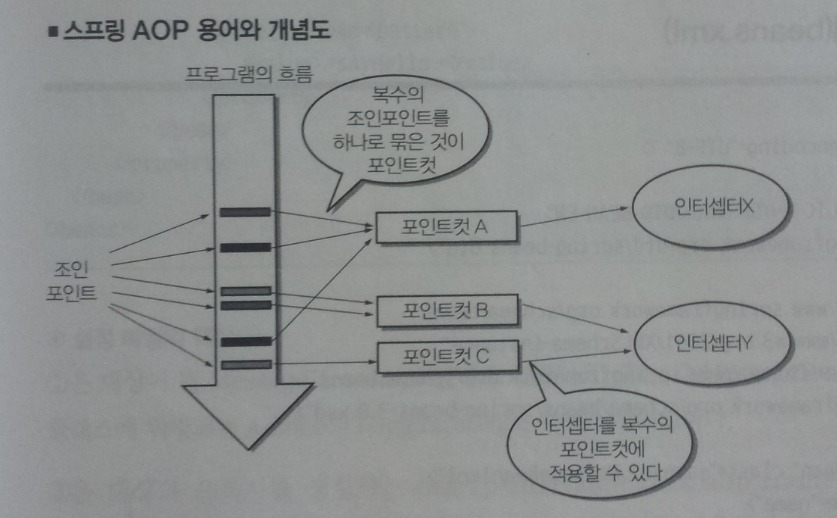

# AOP

# AOP란?

 로깅, 보안 인증 등 **공통적인 관심사**를 **공통 모듈**로 분리하고, 핵심 로직에 영향을 미치지 않고 **사이사이**(조인포인트)에 효과적으로 **삽입**하는 프로그래밍 방법이다.

 핵심 로직을 핵심 기능(Core Concerns)이라 하고, 공통 모듈을 부가 기능(Cross-cutting Concerns)라 한다.

# AOP 구성요소

---

- **조인포인트(join point)**
- 분리한 공통 모듈을 삽입할 특정 위치(메서드 호출 시점, 인스턴스화 되는 시점 등)
- **포인트 컷(point cut)**
- 어느 클래스의 어떤 조인포인트를 사용할 것인지 설정
- **어드바이스(advice)
-** 각 조인포인트에 삽입되어져 동작할 코드
- **위빙(weaving)**
- 포인트 컷에 의해 결정된 조인포인트에 지정된 어드바이스를 삽입하는 과정
- **에스팩트(aspect)**
- 포인트 컷(어디에서) + 어드바이스(무엇을 동작하는지)

# 위빙(Weaving)

---

위빙은 위에서 말한 것처럼 포인트 컷에 의해 결정된 조인포인트에 어드바이스를 적용하는 것을 의미한다. 위빙이 일어나는 시점의 따라 3가지로 분류한다.

### CTW(Compile Time Weaving)

- 컴파일이 일어날 때 위빙하는 것을 의미한다.
- 컴파일 시간이 타 방법보다 길지만, 컴파일이 완료되고 실행하고 있는 경우 이미 타겟에 어드바이스가 적용되었기 때문에 빠르다
- AspectJ의 경우 AJC(AspectJ Compiler)를 통해 java파일을 컴파일한다,
- Lombok 등의 플러그 인과 같이 사용하면 충돌이 발생할 가능성이 높다.

### LTW(Load Time Weaving)

- 클래스가 JVM에 로드 될 때 위빙하는 것을 의미한다.
- 바이트 코드 조작을 통해 위빙하는 방식이다.
- 컴파일에서 위빙이 일어나지 않아 CTW보다 빠르지만 오브젝트가 메모리에 올라가는 과정(Load Time)시 상대적으로 느리다.

### RTW(Runtime Weaving)

- Spring-AOP에서 사용하는 위빙 방식이다.
- 런타임에서 타깃 오브젝트의 변형없이 위빙을 수행한다.
- 포인트 컷의 대한 어드바이스 적용 개수가 많아질수록 생성되는 프록시의 개수가 많아져 성능이 저하되는 단점이 있다.

# Spring-AOP 특징

---

- **Spring은 프록시 기반 AOP를 지원한다.**
 Spring은 target 객체에 대한 프록시를 만들어 제공한다. 해당 프록시는 런타임에 생성된다.
- **프록시가 호출을 가로챈다(Intercept)**
 프록시는 타겟 객체에 대한 호출을 가로챈 다음 부가기능을 핵심기능 전, 후(포인트 컷의 따라) 실행한다.
- **메서드 조인포인트만 지원한다.**
 스프링 AOP는 프록시 기반의 AOP를 지원하기 때문에 각 Request, 즉 메서드의 조인포인트만 지원한다.

# Spring AOP 구조 위치

---

# Spring-AOP Advice

---

- Before : 메서드 실행 전 동작
- After : 메서드 실행 후 동작
- After-returning : 메서드가 정상적으로 실행된 후 동작
- After-throwing : 예외가 발생한 후 동작
- Around : 메서드 호출 이전, 이후, 예외발생 등 모든 시점에서 동작

# 포인트 컷 표현식

### 지정자

가장 많이 사용되는 지정자는 excution과 @anotaion이다. excution은 위의 그림과 같이 다양한 타겟 명세가 가능한 지정자이다. @anotation은 타겟 명세에 지정한 어노테이션을 사용한 메서드에 적용된다.
