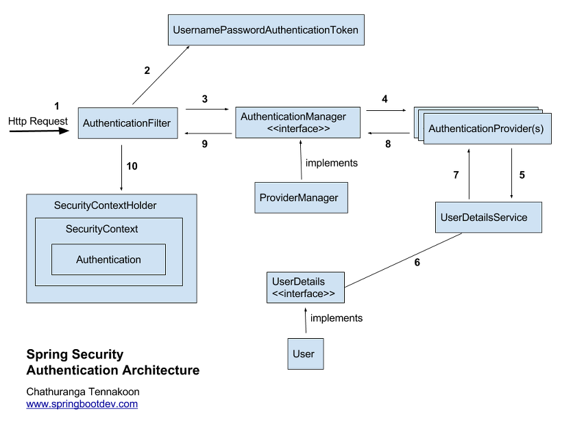
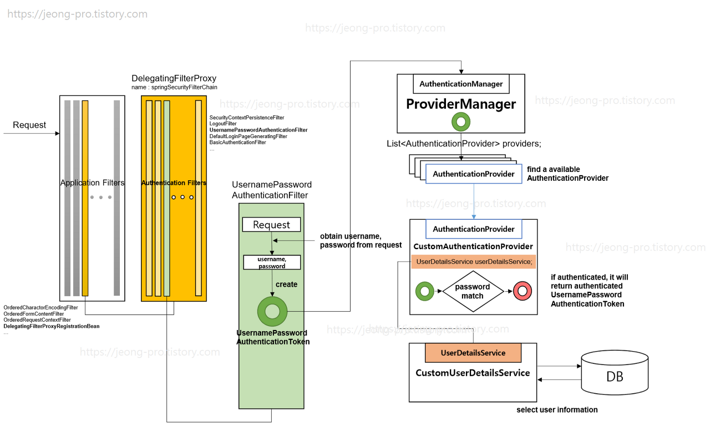

# Spring Security

# 용어

### Authentication(인증)

'A'라고 주장하는 주체가 'A'가 맞는지 확인하는 것

### Authorization(권한)

특정 자원에 대한 권한이 있는지 확인하는 것

### Credential(증명서)

인증 과정 중, 주체가 본인을 인증하기 위해 서버에게 제공하는 것

→ 인증 과정의 따라 다른 Credential을 제출하기 때문에 서버에서 사용하는 인증 과정(ID/Password, JWT, OAUTH 등...)의 따라 맞춰 제출해야한다

# 동작 순서



- 클라이언트(브라우저)로부터 요청(Http Request)가 오면 Application Filter를 만나게 된다.
- Application Filter 중 DelegatingFilterProxyRegistrationBean을 만나며 자동으로 설정된 AuthenticationFilter를 수행한다.
- 각 필터는 doFilter를 통해 순서있게 진행되며, 그 중 실질적인 인증(Authentication)은 UsernamePasswordAuthenticationFilter가 진행한다.
- UsernamePasswordAuthenticationFilter는 AuthenticationManager 구현체인 ProvideManager에게 인증을 위임하고, ProvideManager는 가지고있는 AuthenticationProvider 리스트 중 인증이 가능한 AuthenticationProvider에게 인증을 위임한다.
- 인증이 완료되면 Authentication 구현체를 반환하며 인증된 Authentication은 세션(SpringContextHolder)에 저장하게 된다.

# 메커니즘



## DelegatingFilterProxyRegistrationBean

DelegatingFilterProxyRegistrationBean 
DelegatingFilterProxy 클래스를 스프링 빈으로 등록시키는 역할을 한다.

  Spring Security를 사용한다면 @EnableAutoConfiguration 어노테이션이 동작할 때 **SecurityFilterAutoConfiguration**이 디폴트로 설정되고 이떄 **DelegatingFilterProxyRegistrationBean**은  "**springSecurityFilterChain "**이란 이름을 가진 **DelegatingFilterProxy** 클래스를 빈으로 등록한다.

  Spring Scurity에서 제공하는 **DelegatingFilterProxy** 클래스가 **springSecurityFilterChain** 이름으로 빈에 등록되며 **Application Filter** 중 **DelegatingFilterProxyRegistrationBean** 필터를 만날 때마다 모든 처리를 **DelegatingFilterProxy**(springSecurityFilterChain)에게 위임하는 방식으로 동작하게 된다.

```java
public abstract class AbstractSecurityWebApplicationInitializer
		implements WebApplicationInitializer {

	private static final String SERVLET_CONTEXT_PREFIX = "org.springframework.web.servlet.FrameworkServlet.CONTEXT.";

	public static final String DEFAULT_FILTER_NAME = "springSecurityFilterChain";
//...생략
}

public class SecurityFilterAutoConfiguration {

	private static final String DEFAULT_FILTER_NAME
										 = AbstractSecurityWebApplicationInitializer.DEFAULT_FILTER_NAME;

	@Bean
	@ConditionalOnBean(name = DEFAULT_FILTER_NAME)
	public DelegatingFilterProxyRegistrationBean securityFilterChainRegistration(
			SecurityProperties securityProperties) {
		DelegatingFilterProxyRegistrationBean registration 
												= new DelegatingFilterProxyRegistrationBean(DEFAULT_FILTER_NAME);

		registration.setOrder(securityProperties.getFilter().getOrder());
		registration.setDispatcherTypes(getDispatcherTypes(securityProperties));
		return registration;
	}
// ....생략
}
```

## **springSecurityFilterChain**

springSecurityFilterChain은 AuthenticationFilter라고도 하며 스프링 시큐리티에서 자동으로 생성한다. 리스트 형태로 저장되며 위에서 아래로 순회하며 거친다.

- **WebAsyncManagerIntegrationFilter**
    - SpringSecurityContextHolder는 ThreadLocal기반(하나의 쓰레드에서 SecurityContext 공유하는 방식)으로 동작하는데, 비동기(Async)와 관련된 기능을 쓸 때에도 SecurityContext를 사용할 수 있도록 만들어주는 필터
- **SecurityContextPersistenceFilter**
    - SecurityContext가 없으면 만들어주는 필터
    - SecurityContext는 Authentication 객체를 보관하는 보관 인터페이스다. (구현체가 있어야겠지)
- **HeaderWriterFilter**
    - 응답(Response)에 Security와 관련된 헤더 값을 설정해주는 필터
- **CsrfFilter**
    - CSRF 공격을 방어하는 필터
- **LogoutFilter**
    - 로그아웃 요청을 처리하는 필터
    - DefaultLogoutPageGeneratingFilter가 로그아웃 기본 페이지를 생성함
- **UsernamePasswordAuthenticationFilter** 
→ username, password를 쓰는 form기반 인증을 처리하는 필터.
    - AuthenticationManager를 통한 인증 실행
    - 성공하면, Authentication 객체를 SecurityContext에 저장 후 AuthenticationSuccessHandler 실행
    - 실패하면 AuthenticationFailureHandler 실행
- **RequestCacheAwareFilter**
    - 인증 후, 원래 Request 정보로 재구성하는 필터
- **SecurityContextHolderAwareRequestFilter**
- **AnonymousAuthenticationFilter**
    - 이 필터에 올 때까지 앞에서 사용자 정보가 인증되지 않았다면, 이 요청은 익명의 사용자가 보낸 것으로 판단하고 처리한다. (Authentication 객체를 새로 생성함(AnonymousAuthenticationToken))
- **SessionManagementFilter**
    - 세션 변조 공격 방지 (SessionId를 계속 다르게 변경해서 클라이언트에 내려준다)
    - 유효하지 않은 세션으로 접근했을 때 URL 핸들링
    - 하나의 세션 아이디로 접속하는 최대 세션 수(동시 접속) 설정
    - 세션 생성 전략 설정
- **ExceptionTranslationFilter**
    - 앞선 필터 처리 과정에서 인증 예외(AuthenticationException) 또는 인가 예외(AccessDeniedException)가 발생한 경우, 해당 예외를 캐치하여 처리하는 필터 (모든 예외를 다 이 필터에서 처리하는 건 아님)
- **FilterSecurityInterceptor**
    - 인가(Authorization)를 결정하는 AccessDecisionManager에게 접근 권한이 있는지 확인하고 처리하는 필터

## **UsernamePasswordAuthenticationFilter**

 해당 필터는 Authentication(인증)을 수행하는 필터이다. 이름에서와 같이 id와 pw로 인증을 하며 커스터마이징을 통해 다른 인증 과정으로 변환이 가능하다.

 아래의 코드와 같이 인증을 수행하는 attemptAuthentication메소드는 Authentication 인터페이스를 상속받은 UsernamePasswordAuthenticationToken을 생성하고 AuthenticationManager에게 인증을 위임하는 구조로 이루어져있다.

```java
public Authentication attemptAuthentication(HttpServletRequest request,
			HttpServletResponse response) throws AuthenticationException {
		if (postOnly && !request.getMethod().equals("POST")) {
			throw new AuthenticationServiceException(
					"Authentication method not supported: " + request.getMethod());
		}

		String username = obtainUsername(request);
		String password = obtainPassword(request);

		if (username == null) {
			username = "";
		}

		if (password == null) {
			password = "";
		}

		username = username.trim();

		UsernamePasswordAuthenticationToken authRequest 
									= new UsernamePasswordAuthenticationToken(username, password);

		// Allow subclasses to set the "details" property
		setDetails(request, authRequest);

		return this.getAuthenticationManager().authenticate(authRequest);
	}
```

## AuthenticationManager

Authentication 객체를 받아 인증하고 인증된 Authentication 객체를 돌려주는 authenticate메소드를 가진 인터페이스이다.

```java
public interface AuthenticationManager {
	Authentication authenticate(Authentication authentication)
			throws AuthenticationException;
}
```

## ProvideManager

AuthenticationManager의 구현체이다. 해당 클래스는 AuthenticationProvider 리스트를 전역변수로 가지고 있으며 해당 Authentication 객체를 인증 가능한지 확인하고, 인증 가능한 AuthenticationProvider가 인증을 완료한 Authentication 객체를 반환한다.

```java
public class ProviderManager implements AuthenticationManager, MessageSourceAware,
		InitializingBean {
	private List<AuthenticationProvider> providers = Collections.emptyList();
//...생략(생성자로 providers를 초기화)

public Authentication authenticate(Authentication authentication)
			throws AuthenticationException {
		Class<? extends Authentication> toTest = authentication.getClass();
		AuthenticationException lastException = null;
		AuthenticationException parentException = null;
		Authentication result = null;
		Authentication parentResult = null;
		boolean debug = logger.isDebugEnabled();

		for (AuthenticationProvider provider : getProviders()) {
			if (!provider.supports(toTest)) {
				continue;
			}
			//...생략
			try {
				result = provider.authenticate(authentication);

				if (result != null) {
					copyDetails(authentication, result);
					break;
				}
			}
			catch (AccountStatusException | InternalAuthenticationServiceException e) {
				prepareException(e, authentication);
				// SEC-546: Avoid polling additional providers if auth failure is due to
				// invalid account status
				throw e;
			} catch (AuthenticationException e) {
				lastException = e;
			}
		}
		//...생략
	}
	//...생략
}
```

## AuthenticationProvider

authenticate(..):AuthenticationProvider → 실질적으로 인증하는 메소드

supports(..):AuthenticationProvider  → 해당 Authentication을 인증 가능한지 확인하는 메소드

```java
public interface AuthenticationProvider {
	Authentication authenticate(Authentication authentication)
			throws AuthenticationException;
	boolean supports(Class<?> authentication);
}
```

참조

[https://jeong-pro.tistory.com/205](https://jeong-pro.tistory.com/205)

[https://bamdule.tistory.com/53](https://bamdule.tistory.com/53)